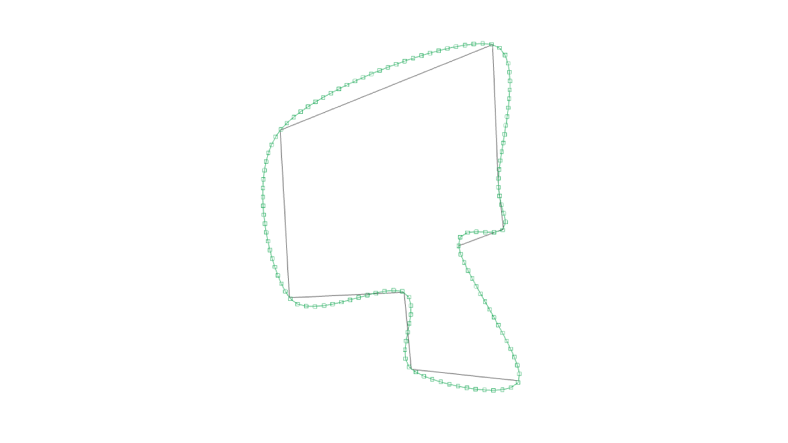

# spline-points

Subdivides a 3d path into spline points

# Example

```sh
npm install spline-points --save
```

```javascript
const splinePoints = require('spline-points')

const points = [[0, 0, 0], [1, 0, 0], [2, 1, 0]]
const smoothPoints = splinePoints(points, { segmentLength: 0.1 })
// smoothPoints = [[0, 0, 0], [0.09, -0.01, 0], [0.19, -0.02, 0], ...]
```

### Running the example

```sh
cd spline-points/example
npm install
budo index.js --open
```

# API

```javascript
var splinePoints = require('spline-points')
```

### `smoothPoints = splinePoints(points, opts)`

Subdivides a 3d path into spline points

- `points` : Array of vec3 - path of 3d points [x, y, z] to subdivide
- `opts`
    - `closed` : Bool - is the path closed?, `false`
    - `segmentLength` : Number - distance between generated points

## License

MIT, see [LICENSE.md](http://github.com/vorg/geom-builder/blob/master/LICENSE.md) for details.
